# TSAO 工艺智能操作系统

[](https://github.com/SUNHAOJUN22/TSAO-PROCESSING-SKILL/actions/workflows/ci.yml)
[](pyproject.toml)
[](LICENSE)
[](reports/QUALIFICATION_BOUNDARY.md)

**面向化工工艺包的可追溯、默认失败关闭 Skill 平台；EPDM 是最深的旗舰路线，POE 是证据谱系最完整的专业路线。**

[English](README.md) · [总体架构](ARCHITECTURE.md) · [能力矩阵](docs/CAPABILITY_MATRIX.md) · [科研诚信](docs/RESEARCH_INTEGRITY.md) · [README 视觉系统](docs/README_VISUAL_SYSTEM.md)

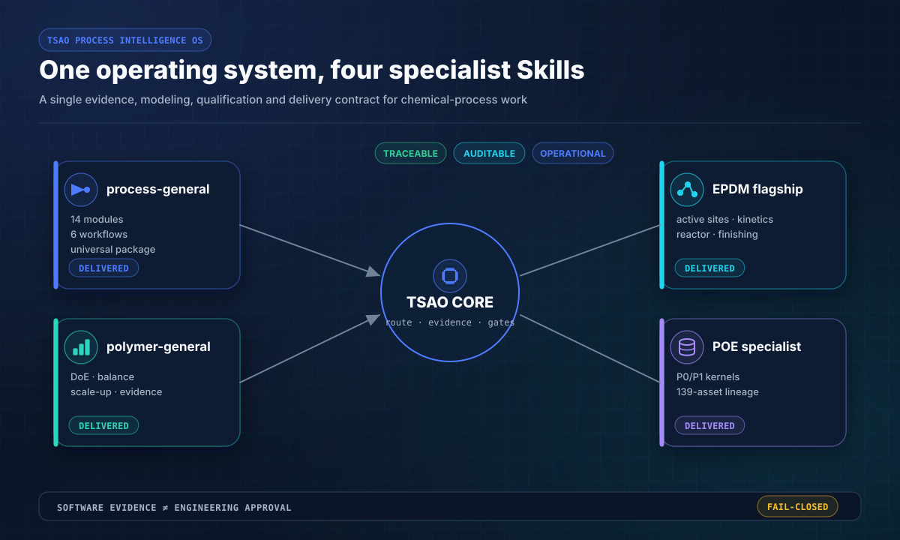

## 一个平台，交付四条 Skill

| Skill | 当前可执行或可交付范围 | 真实边界 |
|---|---|---|
| `process-general` | 通用工艺包合同、14 个模块和 6 条工作流 | 项目工程数据和审批仍需外部完成 |
| `epdm` | 活性位、E/P/二烯动力学、三级模型、半连续闭合、相态/混合/移热、循环毒物和脱挥 | 透明参考计算，不是工业参数认证 |
| `poe` | P0/P1 参考内核和 139 项历史资产受控谱系 | 具有明确证据边界的专业 Alpha |
| `polymer-general` | 通用证据、衡算、DoE、规划和放大工具 | 通用规划工具，不是合格产品配方 |

源码检出和安装后的 Wheel 暴露同一套 Skill 清单：

```bash
python -m tsao.skillpacks --root .
# Wheel 安装后：
tsao-skillpacks
```

四条 Skill、14 个通用模块、6 条工作流、6 个聚合物通用脚本或全部 18 幅 README 图中缺少任何一项，库存检查都会失败关闭。

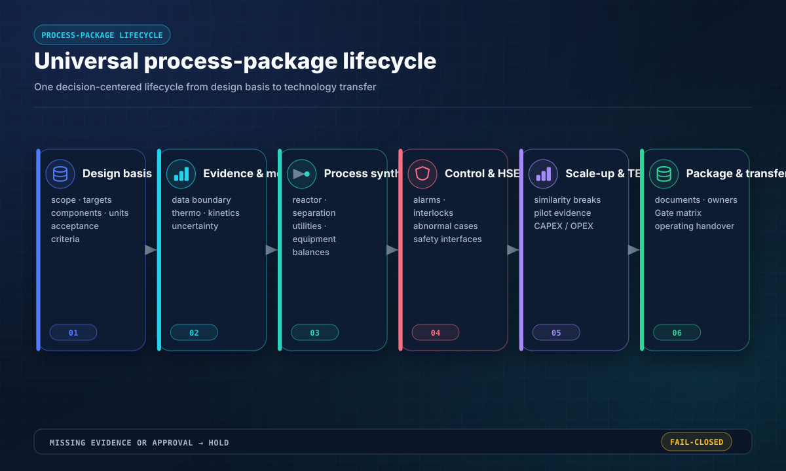

## 通用工艺包平台

通用路线把工艺包视为相互约束的工程系统，覆盖化学、测量、热力学、反应器、传递、分离、循环、公用工程、设备、控制、异常工况、HSE、放大、TEA/LCA 和验收；同一合同可扩展到聚合物、生物过程、电化学、固体/结晶、精细间歇和石油化工。

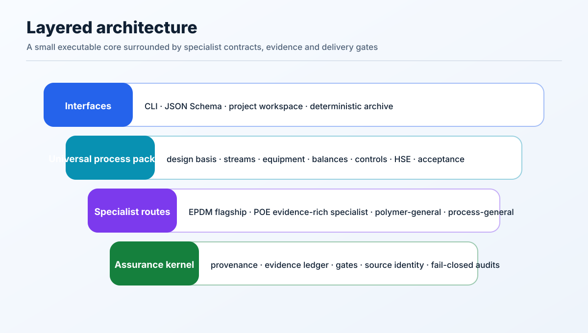

### 连接式数据模型

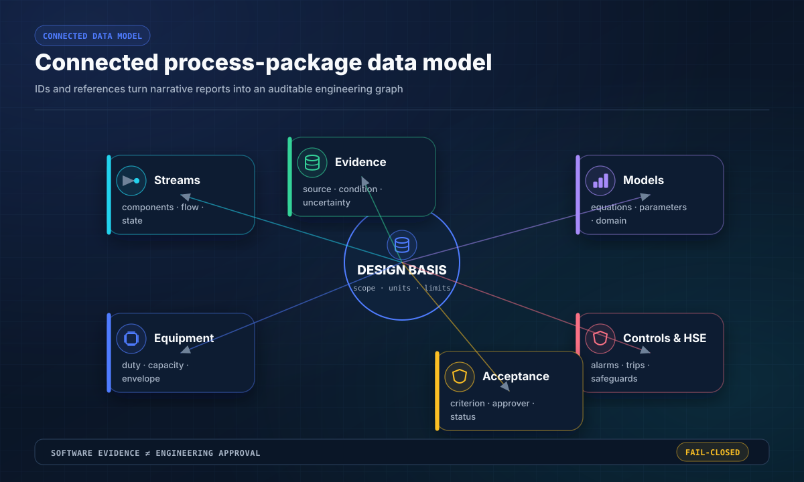

```text
设计基础
  ├─ 物流与组分
  ├─ 设备与操作窗口
  ├─ 物料 / 组分 / 能量衡算
  ├─ 热力学与模型依据
  ├─ 控制 / 报警 / 联锁 / 异常工况
  ├─ HSE 与验收要求
  └─ 证据台账与具名审批
```

未知或证据不足的结论必须输出 `HOLD` 或 `FAIL`，不得被静默提升为 `PASS`。

### 控制、安全与模拟器中立接口

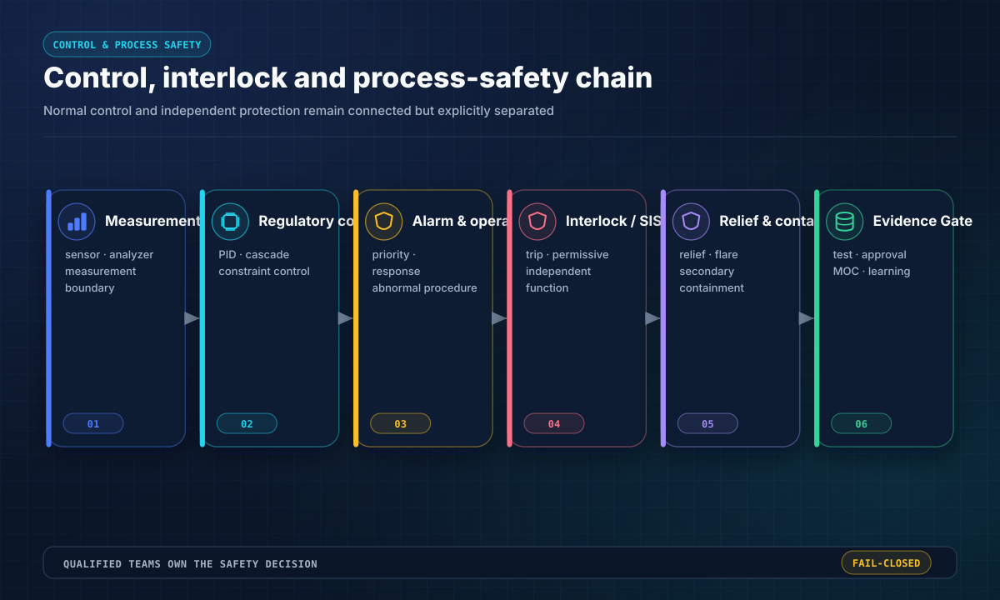

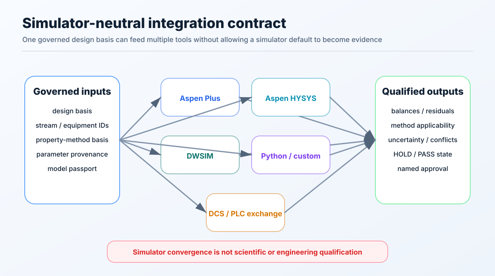

平台结构化管理报警、联锁、Cause & Effect、异常响应以及 HAZID/HAZOP/LOPA/SIL 前置接口。Aspen Plus、Aspen HYSYS、DWSIM、自定义模型和 DCS/PLC 数据交换均受同一设计基础、证据台账和模型护照约束；模拟器收敛不等于技术资格。

## EPDM 旗舰专业路线

EPDM 在通用工艺包之上增加更深的“机理—结构—反应器—后处理—客户”链。

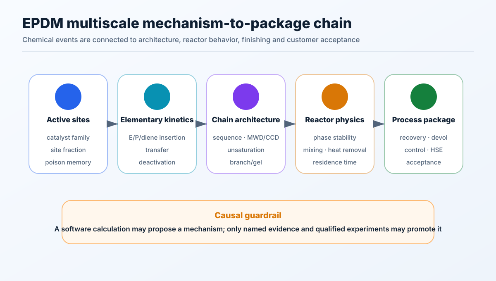

### 催化剂与动力学网络

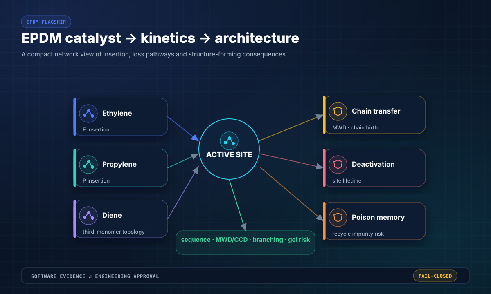

```text
应用 / CQA
→ 催化剂基准与活性位证据
→ E/P/二烯插入、链转移、失活与毒物记忆
→ 序列、MWD/CCD、保留不饱和度、支化与凝胶风险
→ 相稳定、黏度、混合、停留时间与移热
→ 淬灭、脱灰、脱挥、溶剂/单体回收与排放
→ 生胶、混炼、硫化、部件耐久与客户线证据
→ 工艺包验收
```

### 三级模型


| 层级 | 已实现的参考计算 | 用途 |
|---|---|---|
| 一级——筛选 | 活性位归一化、三元增长/链转移/失活、插入分数和快速转化 | 排序与输入检查 |
| 二级——工程 | Arrhenius 修正、停留时间转化、守恒型半连续物料—能量步进、移热/混合、循环毒物和脱挥 Damköhler 数 | 流程研究与实验规划 |
| 三级——详细参考 | 多活性位族、链矩/分散系数、支化/凝胶、Flory–Huggins 稳定性和传热熵产 | 判断是否值得进入 PBM/CFD/EOS 高保真工作 |

### 批量筛选与长轨迹

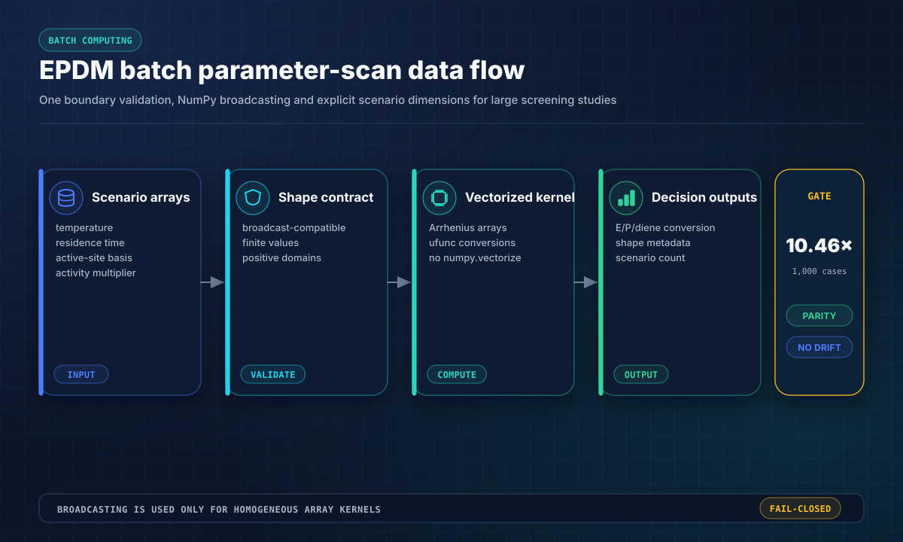

`batch_pseudo_first_order_screening` 对温度、停留时间、活性位浓度和增长速率倍数执行真正的广播计算，不经过 Python 情景循环；`semibatch_trajectory` 只在模型边界校验一次，同时保留完整步进历史；POE 在在线循环不需要历史时提供具名的仅终态 RK4 路径。标量 API 继续作为等价性锚点。

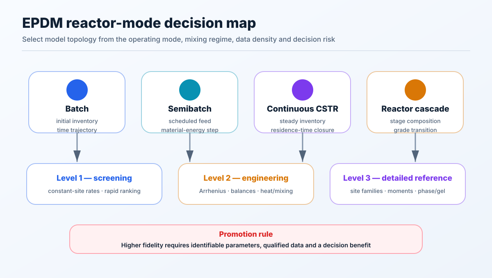

所有层级均输出 `CALCULATED_REFERENCE_ONLY`，不冒充已拟合动力学、商业热力学包、合格 CFD、设备设计、HAZOP/LOPA/SIL、客户认证或工业性能保证。

### 参数可辨识性、不确定度与产品证据

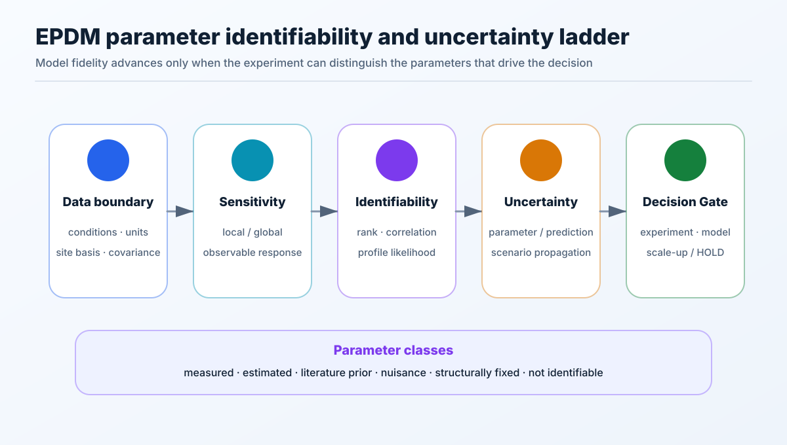

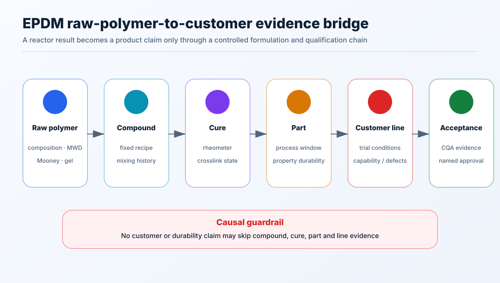

参数必须区分为实测、估计、文献先验、干扰参数、结构固定或不可辨识。反应器结果若没有经过固定配方、混炼、硫化、部件和客户线证据，不得提升为耐久性或客户结论。

### 聚合、后处理与循环


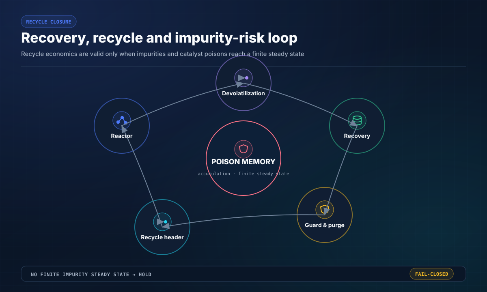

活性位证据、二烯拓扑、移热、高黏混合、相稳定、循环毒物闭合、非平衡脱挥或“生胶—客户线”桥接不完整时，EPDM 审计默认失败关闭。


## 安装与运行

```bash
git clone https://github.com/SUNHAOJUN22/TSAO-PROCESSING-SKILL.git
cd TSAO-PROCESSING-SKILL
python -m pip install -e .[dev]
python -m tsao.cli doctor --root . --profile core
python -m tsao.skillpacks --root .
```

### 通用工艺包

```bash
python -m tsao.cli init --brief examples/generic-process/brief.yaml --out work/demo
python -m tsao.cli audit --root work/demo
python -m tsao.cli package template --family "连续化工过程"
```

### EPDM

```bash
python -m tsao.cli epdm status
python -m tsao.cli epdm reference-demo
python -m tsao.cli epdm model-suite --temperature-k 323.15 --residence-s 300
python -m tsao.cli epdm audit
```

### POE

```bash
python -m tsao.cli poe status --root .
python -m tsao.cli poe audit-p0 --root .
python -m tsao.cli poe audit-p1 --root .
python -m tsao.cli poe reference-demo
```

## 实测性能与可复现性

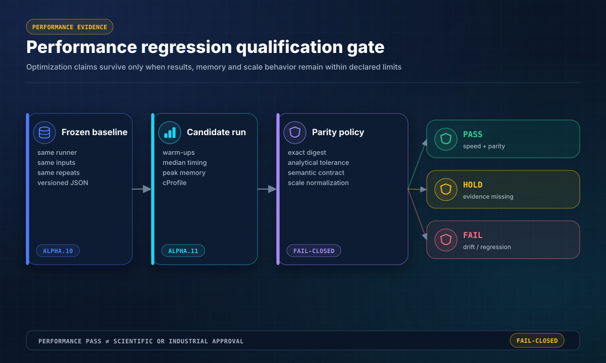

性能结论属于版本化的软件证据，不等于工程或工业资格。发布基准使用 `timeit.repeat` 中位数计时、`cProfile` 定位热点，并用结果 SHA-256 拒绝任何数值漂移。


```bash
python scripts/benchmark_performance_v2.py \
  --repeats 5 --wheel-dir wheelhouse \
  --output reports/runtime/PERFORMANCE_RESULTS_V2.json
python scripts/compare_performance_v2.py \
  --baseline reports/PERFORMANCE_BASELINE_ALPHA10_EXTENDED.json \
  --current reports/runtime/PERFORMANCE_RESULTS_V2.json \
  --output reports/runtime/PERFORMANCE_COMPARISON_V2.json
python scripts/update_performance_readme.py \
  --comparison reports/PERFORMANCE_COMPARISON_ALPHA11.json --check
```

<!-- PERFORMANCE_RESULTS_START -->
| 负载 | 基线中位耗时 | 优化后中位耗时 | 比率 | 峰值内存 | 等价合同 |
|---|---:|---:|---:|---:|---|
| EPDM 三级模型，64 个位点族 | 129.96 µs | 131.24 µs | 0.99× | 37.23 KiB | 精确一致 |
| EPDM 三级模型，512 个位点族 | 937.65 µs | 946.63 µs | 0.99× | 276.29 KiB | 精确一致 |
| EPDM 半连续物料—能量单步 | 13.24 µs | 14.34 µs | 0.92× | 3.12 KiB | 精确一致 |
| EPDM 半连续轨迹，10,000 次公共单步 | 129.11 ms | 142.58 ms | 0.91× | 4.35 MiB | 精确一致 |
| EPDM 筛选，1,000 组标量情景 | 13.50 ms | 13.61 ms | 0.99× | 566.29 KiB | 精确一致 |
| POE RK4，400 步 | 13.93 ms | 6.64 ms | 2.10× | 303.02 KiB | 精确一致 |
| POE RK4，10,000 步 | 345.90 ms | 165.92 ms | 2.08× | 7.26 MiB | 精确一致 |
| POE 有限差分 Jacobian，8 × 200 | 503.52 µs | 493.41 µs | 1.02× | 33.92 KiB | 精确一致 |
| POE 单参数拟合，401 点 | 1.00 ms | 1.01 ms | 0.99× | 31.07 KiB | 精确一致 |
| POE 动态响应，10,000 点 | 241.69 µs | 241.34 µs | 1.00× | 569.67 KiB | 精确一致 |
| 通用工艺包，500 台设备 | 4.43 ms | 4.38 ms | 1.01× | 179.53 KiB | 精确一致 |
| 通用工艺包，5,000 台设备 | 44.28 ms | 44.12 ms | 1.00× | 1.95 MiB | 精确一致 |
| 源身份，300 文件构建与核验 | 25.91 ms | 24.80 ms | 1.04× | 424.10 KiB | 精确一致 |
| 源身份，3,000 文件构建与核验 | 228.88 ms | 229.13 ms | 1.00× | 1.68 MiB | 精确一致 |
| 仓库 Doctor，core 配置 | 126.28 ms | 129.83 ms | 0.97× | 1.29 MiB | 容差 / 语义一致 |
| 四 Skill 库存 | 5.95 ms | 6.35 ms | 0.94× | 137.26 KiB | 容差 / 语义一致 |
| Wheel 内容核验 | 2.93 ms | 3.13 ms | 0.94× | 593.27 KiB | 容差 / 语义一致 |
| EPDM 筛选，1,000 组广播情景 | 13.50 ms | 1.41 ms | 9.56× | 613.93 KiB | 容差 / 语义一致 |
| EPDM 半连续轨迹，一次校验 10,000 步 | 129.11 ms | 47.21 ms | 2.73× | 4.35 MiB | 精确一致 |
| POE RK4 仅终态，10,000 步 | 345.90 ms | 143.77 ms | 2.41× | 5.59 KiB | 容差 / 语义一致 |

| 尺度对 | 归一化耗时比 | 上限 | Gate |
|---|---:|---:|---|
| EPDM 三级模型，64 个位点族 → EPDM 三级模型，512 个位点族 | 0.902 | 1.25 | 通过 |
| 通用工艺包，500 台设备 → 通用工艺包，5,000 台设备 | 1.006 | 1.25 | 通过 |
| 源身份，300 文件构建与核验 → 源身份，3,000 文件构建与核验 | 0.924 | 1.25 | 通过 |
<!-- PERFORMANCE_RESULTS_END -->

v2 性能门保护 17 个共用负载和 3 条新增优化路径。结构稳定的结果继续要求精确 SHA-256；浮点数组和 LAPACK 路径采用具名解析容差测试；Doctor 与 Wheel 采用语义合同；同时约束峰值内存和 10 倍尺度效率。NumPy 仍是唯一必需加速依赖，SciPy、Numba 和 JAX 只有在独立跨平台资格证明净收益后才会成为可选后端。

## 证据与资格门

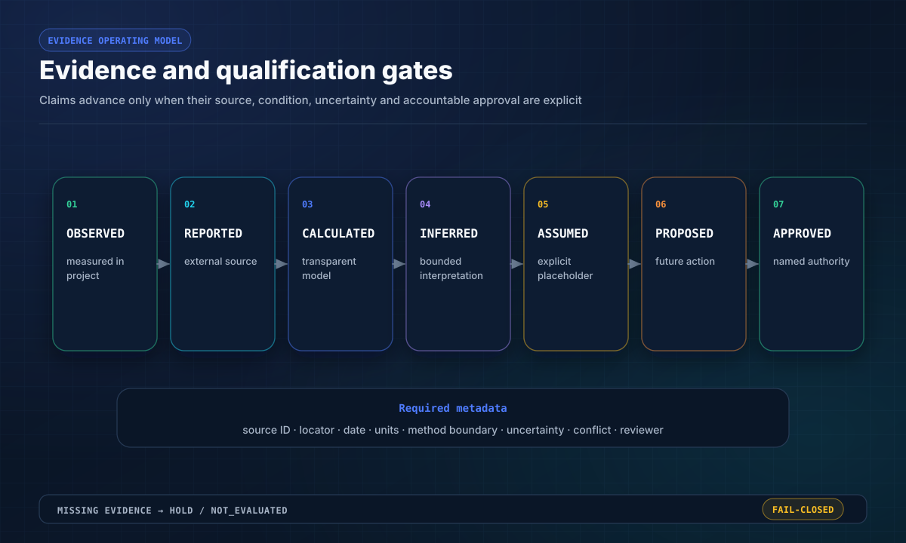

面向决策的结果必须保留来源 ID、条件、单位、方法边界、假设、不确定度、冲突记录和当前 Gate。软件测试只能证明代码按声明运行，不能批准化学、设备、安全、客户性能或装置经济性。

## 自动验证与 Wheel 交付

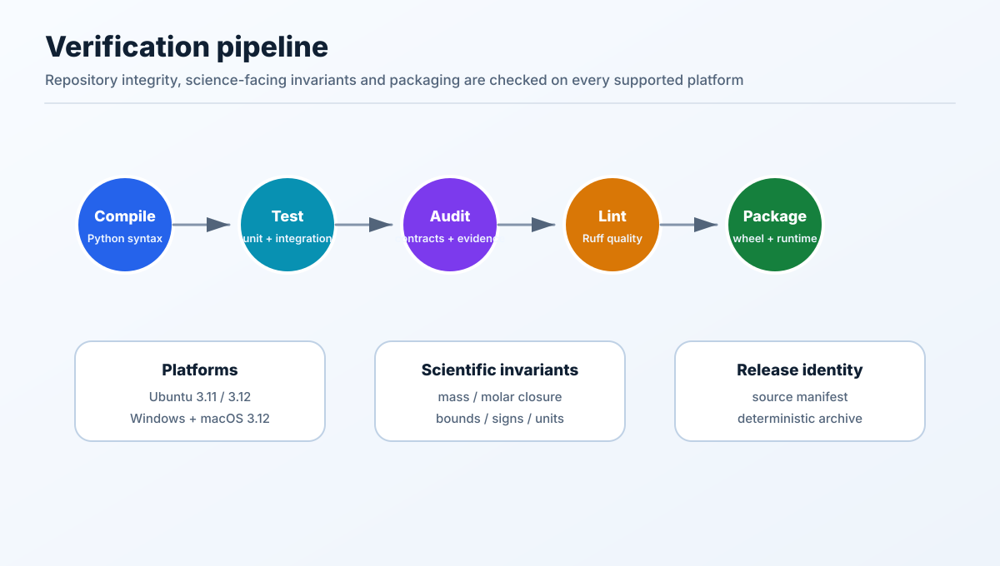

```bash
python scripts/generate_readme_assets.py
python scripts/generate_extended_readme_assets.py
python scripts/generate_decision_readme_assets.py
python scripts/generate_performance_readme_assets.py
python scripts/generate_uiux_readme_assets.py
python scripts/harden_readme_svg_accessibility.py
python scripts/verify_readme_visual_accessibility.py
python scripts/sync_readme_visuals.py --check
python scripts/run_ci.py
python skills/epdm/scripts/audit_epdm.py
python skills/poe/scripts/audit_p0.py --root .
python skills/poe/scripts/audit_p1.py --root .
python -m pip wheel --no-deps --no-build-isolation . -w wheelhouse
python scripts/verify_wheel_contents.py --wheel-dir wheelhouse
python scripts/verify_wheel_runtime.py --wheel-dir wheelhouse
```

Wheel 具有两道独立质量门：

1. **内容门：**必须包含可执行内核、完整四 Skill 树、合同、Schema、报告、维护脚本、示例和全部 18 幅图；
2. **安装门：**同时验证 `pip install --target` 与不继承系统 site-packages 的干净标准虚拟环境；TSAO、EPDM、POE 模块及 Skill 数据根必须全部位于所选安装根内，随后才允许通过安装态 README 与已知解检查。

CI 覆盖 Ubuntu/Python 3.11–3.14，以及 Windows、macOS 的 Python 3.14；检查编译、测试、分支覆盖率、合同、溯源、Ruff、EPDM/POE 审计、确定性图形、Wheel 内容、真实安装态运行和 CLI 冒烟测试。覆盖率完成后，独立审计并行执行；Ubuntu/Python 3.14 还强制执行版本化性能回归门。

源文件清单属于发布身份：源文件变化若未同步刷新 `reports/SOURCE_CORE_MANIFEST.tsv`，仓库 Doctor 将按设计失败。

## 仓库结构

```text
tsao/                       通用可执行内核、CLI 与 Skillpack 库存
skills/process-general/     14 个通用工艺模块和 6 条工作流
skills/epdm/                EPDM 旗舰计算、合同与审计
skills/poe/                 POE 专业能力与受控证据谱系
skills/polymer-general/     聚合物通用规划和衡算工具
schemas/                    跨项目机器可读合同
scripts/                    CI、溯源、打包和图形生成
docs/assets/readme/         仓库自有确定性 SVG 功能图
reports/                    资格、谱系与分支收敛记录
tests/                      仓库、安全、Schema 与集成测试
```

## 状态语言

| 状态 | 含义 |
|---|---|
| `PASS` | 所声明的软件或证据 Gate 已满足 |
| `HOLD` | 必需证据、资格或审批不完整 |
| `FAIL` | Schema、衡算、不变量、引用或完整性规则被破坏 |
| `NOT_EVALUATED` | 尚未形成合格结论 |
| `CALCULATED_REFERENCE_ONLY` | 透明参考计算，不是已拟合或批准的设计结果 |

## 分支与责任边界

`main` 是唯一权威分支，收敛记录见 [reports/BRANCH_CONSOLIDATION_2026-07-23.md](reports/BRANCH_CONSOLIDATION_2026-07-23.md)。本仓库不替代合格工艺设计、实验室工作、设备/泄放设计、HAZOP/LOPA/SIL、法律审查、环境许可、客户试验或装置运行批准。
