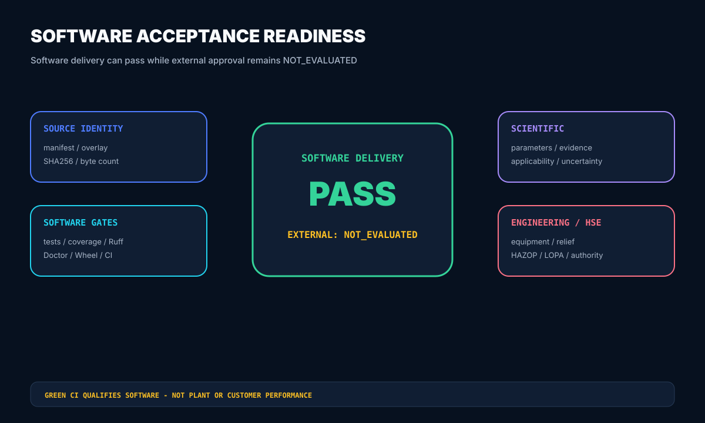
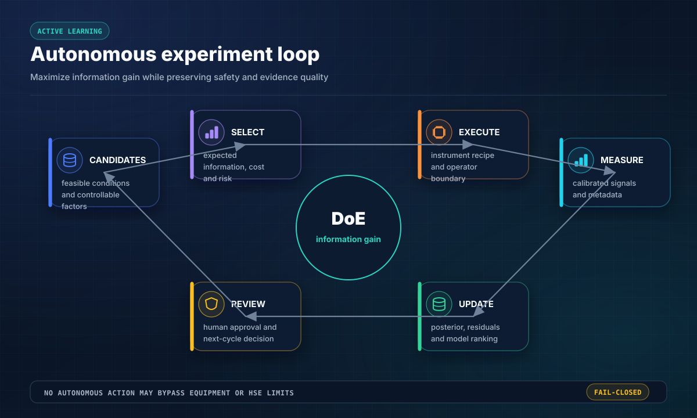
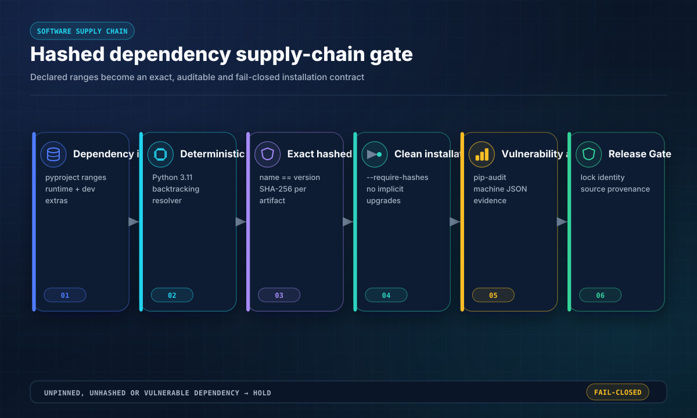
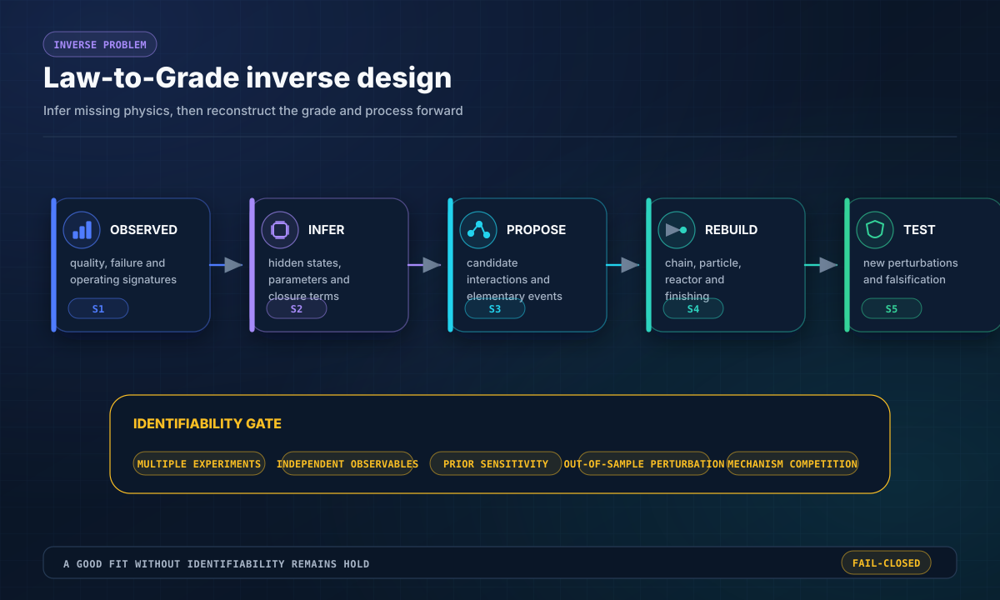
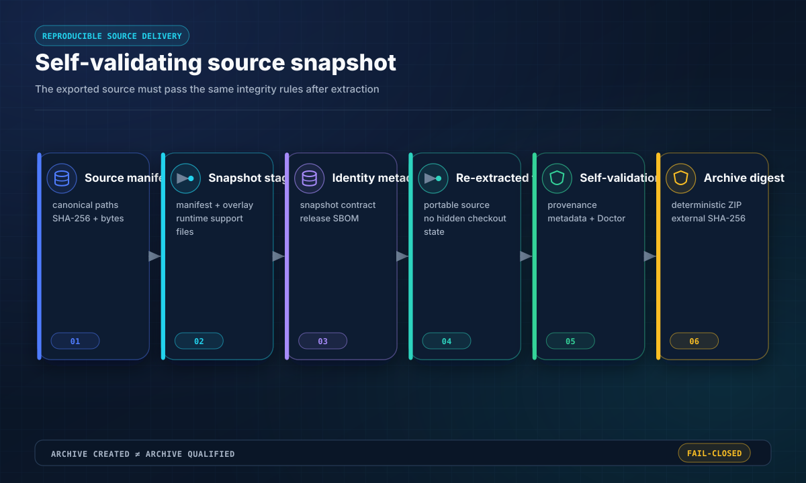
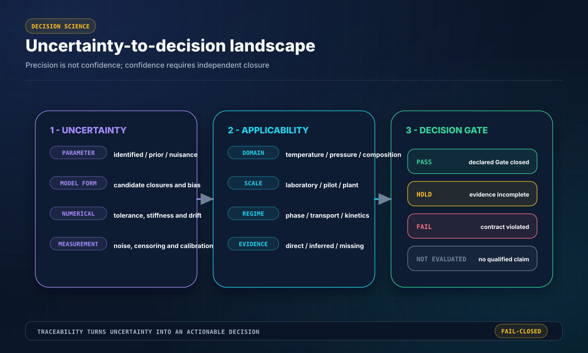

# TSAO Process Intelligence OS

[English](README.md) · [架构](ARCHITECTURE.md) · [能力矩阵](docs/CAPABILITY_MATRIX.md) · [视觉系统](docs/README_VISUAL_SYSTEM.md)

**面向化工过程 Skill、受治理数理模型、证据链、来源身份和验收交付的 fail-closed 软件系统。**

<!-- LOCALIZED_VISION_ZH:START -->
## 中文项目愿景图：从反应机理到材料牌号与工艺窗口

<p align="center">
  
</p>

> 图中公式映射当前过程、EPDM、POE 与聚合物通用 Skill 的软件合同；它不是装置标定、客户牌号认证或 HSE 结论。

<!-- LOCALIZED_VISION_ZH:END -->

## 已交付系统

TSAO 安装四个 Skill：`process-general`、`epdm`、`poe` 与 `polymer-general`。源码树和 Wheel 必须暴露同一组模块、Schema、报告、CLI、测试和 **32 幅确定性 SVG 示意图**。`PASS` 只代表软件行为合格；科学、工程、HSE、客户和工业批准继续保持 `NOT_EVALUATED`。

## 验收命令

```bash
python -m pip install -e .[dev]
python -m tsao.cli doctor --root . --profile core
python -m tsao.cli delivery-report --root .
python -m tsao.skillpacks --root .
python -m tsao.cli init --brief examples/generic-process/brief.yaml --out work/demo
python -m tsao.cli audit project --root work/demo
python -m tsao.cli epdm validate-v2 --file skills/epdm/fixtures/v2_phase_a2_reference_project.json
python -m tsao.cli epdm canonicalize --file skills/epdm/fixtures/v2_phase_a2_reference_project.json --out work/canonical.json
python -m tsao.cli epdm qualify-acceptance --project skills/epdm/fixtures/v2_phase_a1_reference_project.json --output reports/runtime/EPDM_SOFTWARE_ACCEPTANCE.json --load-samples 7
```

来源身份使用 canonical bytes 的 `SHA256` 绑定。EPDM V2 路径为事务式流程：严格 JSON → 显式版本 → Schema → 冻结 dataclass → 临时 `ContractRegistry` → 跨注册表引用闭合 → 不可变发布。重复键、非有限数、类型混淆、重复 ID 和悬空引用均 fail-closed。

## 受治理数理程式

以下方程是透明的 calculated-reference 软件合同，**不替代合格工艺设计**或完成标定的工业模型。

$$
\frac{d\mathbf{N}}{dt}=F_{in}\mathbf{z}-F_{out}\mathbf{x}+V\boldsymbol{\nu}^{\mathsf T}\mathbf{r}
$$
$$
mC_p\frac{dT}{dt}=\sum F_i h_i-V\sum_j\Delta H_jr_j-UA(T-T_c)
$$
$$
k_j(T)=A_j\exp\!\left(-\frac{E_j}{RT}\right),\qquad r_j=k_j(T)a_s\prod_i C_i^{\alpha_{ij}}
$$
$$
f_m=\frac{r_m}{\sum_n r_n},\qquad \sum_m f_m=1
$$
$$
\mu_k=\sum_{p=0}^{\infty}p^kn_p,\quad M_n\propto\frac{\mu_1}{\mu_0},\quad M_w\propto\frac{\mu_2}{\mu_1},\quad Đ=\frac{\mu_0\mu_2}{\mu_1^2}
$$
$$
\frac{\Delta G_{mix}}{RT}=\frac{\phi_1}{N_1}\ln\phi_1+\frac{\phi_2}{N_2}\ln\phi_2+\chi\phi_1\phi_2
$$
$$
\mathrm{Da}_v=k_v\tau,\qquad \dot S_{gen}=\dot Q\left(\frac1{T_c}-\frac1{T_h}\right)\ge0
$$
$$
e_i=\frac{y_i^{(5)}-y_i^{(4)}}{\mathrm{atol}_i+\mathrm{rtol}_i\max(|y_i|,|y_i^{(5)}|)},\qquad \|\mathbf e\|_2\le1
$$
$$
J(\boldsymbol\theta)=\sum_iw_i[y_i-\hat y_i(\boldsymbol\theta)]^2,\qquad \mathbf{F}=\mathbf{S}^\mathsf{T}\mathbf{W}\mathbf{S}
$$
$$
\operatorname{Cov}(\hat{\boldsymbol\theta})\approx\sigma^2\mathbf F^{-1},\qquad \operatorname{Var}[g]\approx\nabla g^\mathsf T\operatorname{Cov}(\boldsymbol\theta)\nabla g
$$

DOPRI5(4) 只有在缩放误差、守恒、有限性和时间单调 Gate 全部通过时才接受步长。Fisher 信息奇异、证据未闭合或预测点超出适用域时必须返回 `HOLD`，不得制造虚假置信度。

## 使用策略

1. 先把任务路由到最窄的有效 Skill。
2. 参数登记前先登记证据与适用域。
3. 优化前先闭合物料与能量衡算。
4. A2/A3/A4 执行前先发布 canonical contract。
5. 参数拟合与科学资格必须分离。
6. 用不确定度和可辨识性决定下一项实验。
7. Wheel 与源码快照必须来自同一 exact qualified tree。
8. 只有具名责任人与签署证据才能提升批准状态。

## 验证流程

```bash
python scripts/verify_dependency_lock.py requirements.lock --pyproject pyproject.toml
python scripts/run_ci.py
python skills/epdm/scripts/audit_epdm.py
python skills/poe/scripts/audit_p0.py --root .
python skills/poe/scripts/audit_p1.py --root .
python -m pip wheel --no-deps --no-build-isolation . -w wheelhouse
python scripts/verify_wheel_contents.py --wheel-dir wheelhouse
python scripts/verify_wheel_runtime.py --wheel-dir wheelhouse
python scripts/verify_acceptance_runtime.py --wheel-dir wheelhouse
python scripts/export_source_snapshot.py --root . --out dist/source.zip
```

CI 对 Windows 与 Ubuntu 的 Python 3.11–3.14 完整矩阵进行资格验证；安装门同时检查 `pip install --target` 与不继承系统 site-packages 的标准虚拟环境。

视觉系统由历史 21 幅核心图扩展为 32 幅受治理验收图谱。

## 受治理视觉图谱


















## 责任边界

`main` 是唯一权威分支。TSAO 不替代实验数据、商业物性包、设备与泄放设计、HAZOP/LOPA/SIL、法律与环保审查、客户试验或生产运行批准。
